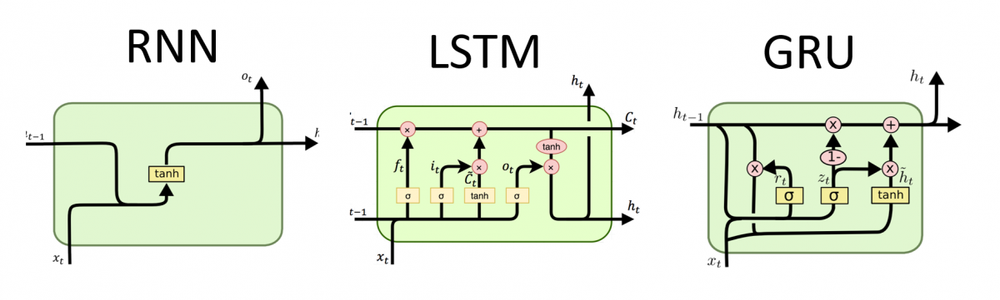
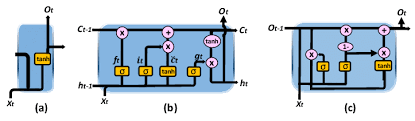
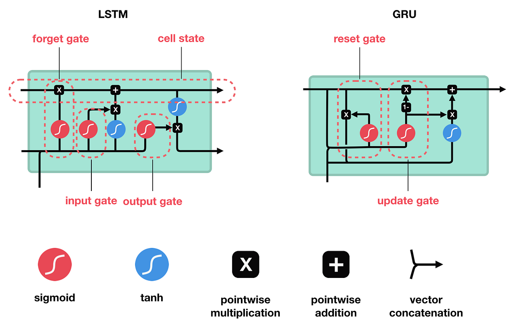

## 1) RNN

### Forward

* **Hidden State/Context/Activation** :
    $$
    a^{\langle t\rangle} = g\!\left(W_{aa}a^{\langle t-1\rangle} + W_{ax}x^{\langle t\rangle} + b_a\right)
    $$

* **Predictions/Output**:
    $$
    \quad
    y^{\langle t\rangle}=g_{\text{out}}\!\left(W_{ya}a^{\langle t\rangle}+b_y\right)
    $$

### Forward (compact form)

Starting from :

$$
W_{aa}a^{\langle t-1\rangle}+W_{ax}x^{\langle t\rangle}+b_a.
$$

Form the block matrix and stacked input:

* Concatenated weight matrix $W_{\alpha}$ :
$$
W_a=\;\begin{bmatrix}W_{aa}&W_{ax}\end{bmatrix}\in\mathbb{R}^{h\times(h+d)}
$$

* Concatenated activation matrix $x^{\langle t\rangle}$ :
$$
\quad
\bar{x}^{\langle t\rangle}=\begin{bmatrix}a^{\langle t-1\rangle}\\ x^{\langle t\rangle}\end{bmatrix}\in\mathbb{R}^{h+d}.
$$

* Resulting compact form :
$$ W_a\,\bar{x}^{\langle t\rangle}=W_{aa}a^{\langle t-1\rangle}+W_{ax}x^{\langle t\rangle}$$
* Apply $g(\cdot)$ and add $b_a$ as before.

### Shapes

* Input dim $d$, hidden dim $h$, output dim $o$.
* $x^{\langle t\rangle} \in\mathbb{R}^{d\times1}$
* $a^{\langle t-1\rangle}, \in\mathbb{R}^{h\times1}$
* $y^{\langle t\rangle} \in\mathbb{R}^{o\times1}$
* $W_{ax}\in\mathbb{R}^{h\times d},\;W_{aa}\in\mathbb{R}^{h\times h},\;b_a\in\mathbb{R}^{h\times1},\;W_{ya}\in\mathbb{R}^{o\times h},\;b_y\in\mathbb{R}^{o\times1}$.
* $W_a\in\mathbb{R}^{h\times(h+d)}$ (just $[W_{aa}\;W_{ax}]$ side-by-side), $b_a\in\mathbb{R}^{h\times1}$

---

## 2) GRU

### Equations

* Remember that $c^{\langle t\rangle}=a^{\langle t\rangle}$

* **Candidate** $\tilde{c}^{\langle t\rangle}$ (a.k.a. candidate hidden):

  $$
  \tilde{h}^{\langle t\rangle}=\tilde{c}^{\langle t\rangle}=\tanh\!\left(W_c\,[\Gamma_r^{\langle t\rangle}\!\odot c^{\langle t-1\rangle},\,x^{\langle t\rangle}] + b_c\right)
  $$

* **Update gate** $\Gamma_u$:

  $$
  \Gamma_u^{\langle t\rangle}=\sigma\!\left(W_u\,[c^{\langle t-1\rangle},\,x^{\langle t\rangle}] + b_u\right)
  $$

* **Reset (Relevance) gate** $\Gamma_r$:

  $$
  \Gamma_r^{\langle t\rangle}=\sigma\!\left(W_r\,[c^{\langle t-1\rangle},\,x^{\langle t\rangle}] + b_r\right)
  $$

* **Hidden State/Context/Activation** $c^{\langle t\rangle}$:

  $$
  h^{\langle t\rangle}=c^{\langle t\rangle}=\Gamma_u^{\langle t\rangle}\odot \tilde{c}^{\langle t\rangle}+(1-\Gamma_u^{\langle t\rangle})\odot c^{\langle t-1\rangle}
  $$

* **Predictions/Output**:

  $$
  \quad
  y^{\langle t\rangle}=g_{\text{out}}\!\left(W_{ya}a^{\langle t\rangle}+b_y\right)
  $$

### Shapes

* Input dim $d$, hidden dim $h$, output dim $o$.
* Gates / states: $\Gamma_u^{\langle t\rangle},\Gamma_r^{\langle t\rangle},\tilde{c}^{\langle t\rangle},c^{\langle t\rangle}\in\mathbb{R}^{h\times1}$.
* $W_u,W_r,W_c\in\mathbb{R}^{h\times(h+d)}$, biases $b_u,b_r,b_c\in\mathbb{R}^{h\times1}$.
* $y^{\langle t\rangle} \in\mathbb{R}^{o\times1}$
* $W_{ya}\in\mathbb{R}^{o\times h},\;b_y\in\mathbb{R}^{o\times1}$.

---

## 3) LSTM

### Equations

* In LSTMs $c^{\langle t\rangle} \neq a^{\langle t\rangle}$

* **Candidate** $\tilde{c}^{\langle t\rangle}$:

  $$
  \tilde{c}^{\langle t\rangle}=\tanh\!\left(W_c\,[a^{\langle t-1\rangle},\,x^{\langle t\rangle}] + b_c\right)
  $$

* **Update gate** $\Gamma_u$:

  $$
  \Gamma_u^{\langle t\rangle}=\sigma\!\left(W_u\,[a^{\langle t-1\rangle},\,x^{\langle t\rangle}] + b_u\right)
  $$

* **Forget gate** $\Gamma_f$:

  $$
  \Gamma_f^{\langle t\rangle}=\sigma\!\left(W_f\,[a^{\langle t-1\rangle},\,x^{\langle t\rangle}] + b_f\right)
  $$

* **Output gate** $\Gamma_o$:

  $$
  \Gamma_o^{\langle t\rangle}=\sigma\!\left(W_o\,[a^{\langle t-1\rangle},\,x^{\langle t\rangle}] + b_o\right)
  $$

* **Cell State**:

  $$
  c^{\langle t\rangle}=\Gamma_u^{\langle t\rangle}\odot \tilde{c}^{\langle t\rangle}+\Gamma_f^{\langle t\rangle}\odot c^{\langle t-1\rangle}
  $$

* **Activation/Hidden State/Context**:

  $$
  a^{\langle t\rangle}=\Gamma_o^{\langle t\rangle}\odot \tanh\!\left(c^{\langle t\rangle}\right)
  $$

* **Predictions/Output**:

  $$
  \quad
  y^{\langle t\rangle}=g_{\text{out}}\!\left(W_{ya}a^{\langle t\rangle}+b_y\right)
  $$

### Shapes

* Input dim $d$, hidden dim $h$, output dim $o$.
* Gates / states: $\Gamma_f^{\langle t\rangle},\Gamma_u^{\langle t\rangle},\Gamma_o^{\langle t\rangle},\tilde{c}^{\langle t\rangle},c^{\langle t\rangle},a^{\langle t\rangle}\in\mathbb{R}^{h\times1}$.
* $W_f,W_u,W_o,W_c\in\mathbb{R}^{h\times(h+d)}$, biases $b_f,b_u,b_o,b_c\in\mathbb{R}^{h\times1}$.
* $y^{\langle t\rangle} \in\mathbb{R}^{o\times1}$
* $W_{ya}\in\mathbb{R}^{o\times h},\;b_y\in\mathbb{R}^{o\times1}$.

